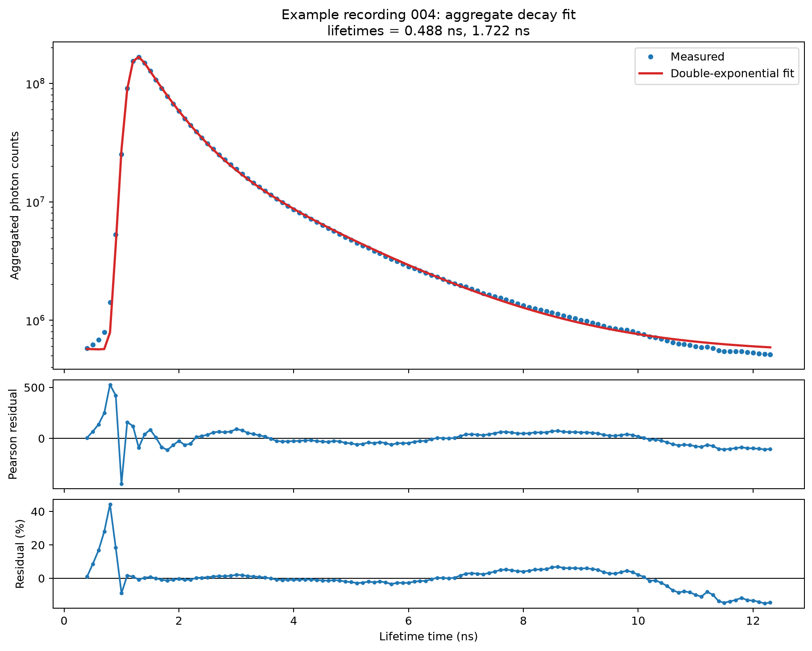
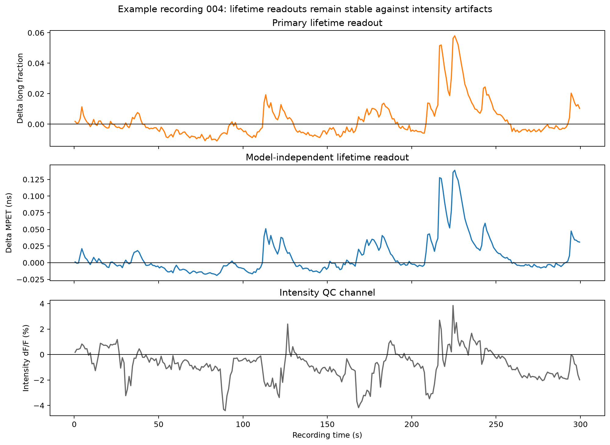

# iFLiP3 lifetime analysis

Research tools for fluorescence-lifetime photometry recorded in `.iFLiP3`
files. The primary workflow combines a model-independent lifetime measurement
(MPET) with fixed-basis two-state target analysis. Intensity is retained as a
quality-control channel rather than treated as the primary readout.

> This project is private and pre-release. See `NOTICE.md` before publishing or
> redistributing it.

## Recommended analysis

1. Safely parse the `.iFLiP3` header without executing MATLAB code.
2. Select the background recorded at the matching laser power. Pool background
   files only when their acquisition conditions are identical.
3. Correct detector dead time, measured background, and afterpulsing.
4. Restrict lifetime calculations to the artifact-free 0.4–12.3 ns window.
5. Calculate MPET directly from each corrected photon-arrival histogram.
6. Fit one high-count aggregate decay to estimate the two lifetimes, `t0`, IRF
   width, and one recording-level residual background.
7. Fix those parameters and solve only the two nonnegative component photon
   contributions at each time point.
8. Compare the long-lifetime photon fraction with MPET. Use intensity for QC.

This fixed-basis step is target analysis. It is globally constrained because
all time points share the same lifetime basis, but it avoids fitting an
independent background at every time point. The latter was found to be nearly
non-identifiable with the long-lifetime component.

The package retains `fit_global` as an experimental advanced method for cases
where shared lifetimes truly need to be estimated from several low-count decay
matrices simultaneously.

## Installation

Install iFLiP3 as part of the authoritative monorepo workspace. Open PowerShell
in the monorepo root, where `uv.lock` is located, then run:

```powershell
python -m pip install "uv==0.12.21"
uv python install 3.12
uv sync --frozen --all-packages --extra dev
uv run python -m pytest packages/iflip3-analysis/tests
```

Conda is not required. `uv` creates a repository-local `.venv` containing the
locked workspace dependencies. For later sessions, open PowerShell in the
monorepo root and launch Jupyter with:

```powershell
uv sync --frozen --all-packages --extra notebooks
uv run jupyter lab
```

## Run the example workflow

Use `packages/iflip3-analysis/examples/notebooks/01_lifetime_qc.ipynb` for the
maintained end-to-end example. Its configuration selects the measurement and
matched background explicitly, together with temporal binning, afterpulse
ratio, and lifetime window. A background may live outside the measurement
folder and may be reused only when laser power, detector settings, timing
configuration, and relevant optical conditions are unchanged. Record the
selected background with every result and acquire replacements periodically to
quantify long-term drift.

## Getting started in Jupyter

Three output-free notebooks are retained without storing
mouse data in the repository:

1. [`01_lifetime_qc.ipynb`](examples/notebooks/01_lifetime_qc.ipynb) loads one
   session, calculates MPET, checks event counts, and plots lifetime, intensity,
   and synchronization QC.
2. [`02_pynapple_event_analysis.ipynb`](examples/notebooks/02_pynapple_event_analysis.ipynb)
   converts the aligned session to Pynapple and demonstrates Ensure-aligned
   lifetime, running, and licking analyses.
3. [`03_decay_component_exploration_draft.ipynb`](examples/notebooks/03_decay_component_exploration_draft.ipynb)
   preserves an exploratory two-state decay-component analysis. It is labeled
   as a research draft because its modeling assumptions and workflow have not
   yet been promoted to the supported package API.

Launch JupyterLab from the monorepo root:

```powershell
uv run jupyter lab
```

Open the first notebook and edit its session-configuration cell. Run the
lifetime QC notebook before the event-analysis notebook. The first two
notebooks call the package API directly. Treat the third notebook as a
preserved analysis draft rather than a validated example.

## Example results

The figures below were generated from local example recording 004 with an
afterpulse ratio of 0.03, its matching high-power background file, one-second
temporal bins, and the 0.4–12.3 ns lifetime window. No source data or
animal/session identifier is included in the repository.

The aggregate decay is fit once to establish the fixed two-state lifetime basis
and recording-level residual background:



Target analysis then estimates only the two component photon contributions at
each time point. MPET independently reproduces the component-fraction dynamics,
while intensity is retained as a QC channel and shows additional artifacts:



Reproduce the analysis from a local dataset with the lifetime-QC notebook and
record the selected background and afterpulse settings with the output.

## Core API

```python
from iflip3 import (
    average_background,
    calculate_mpet,
    fit_decay,
    fit_target,
    lifetime_window,
    read_iflip3,
)
```

`fit_target` never fits a separate local background. A known fixed residual
background may be supplied with `residual_background_per_bin`.

## Event-aligned analysis

The package can align each iFLiP recording to its companion NI-DAQ recording.
Marker 1 in iFLiP and the 5 Hz pulse train in NI-DAQ row 2 establish an affine
clock conversion, which corrects both the acquisition offset and clock drift.
The resulting MPET samples and behavior events are all expressed on the NI-DAQ
clock.

Because a uniform 5 Hz train does not encode pulse identity, the default clock
fit assumes that the first saved iFLiP marker and first saved NI-DAQ pulse are
the same physical pulse. This is appropriate when both pulse trains are already
being recorded as the acquisitions start. If a known leading pulse was missed,
set `iflip_sync_start_index` or `nidaq_sync_start_index` in Python, or use the
matching command-line options, to select the corresponding first pulse.

NI-DAQ `channelnames` metadata are deliberately ignored because they are
incorrect in the current acquisition files. The default mapping is fixed from
the laboratory wiring:

| Hardware row | Python index | Signal |
|---:|---:|---|
| 1 | `data[0]` | photoreceiver 1 |
| 2 | `data[1]` | 5 Hz iFLiP synchronization TTL |
| 3 | `data[2]` | photoreceiver 2 |
| 4 | `data[3]` | licking TTL |
| 5 | `data[4]` | visual cue TTL |
| 6 | `data[5]` | 465-nm TTL |
| 7 | `data[6]` | 405-nm TTL |
| 8 | `data[7]` | Ensure/solenoid TTL |

### Laboratory file locations

Files can be located from mouse, date, and run using the same hierarchy as the
photometry analysis. The default base is `Z:\`:

```text
Z:\Photometry\<mouse>\<mouse>_<date>\<mouse>-<date>-<run>-nidaq.mat
Z:\Photometry\<mouse>\<mouse>_<date>\<mouse>-<date>-<run>-running.mat
Z:\FLIM FLIP\<mouse>\<mouse>_<date>\<mouse>_<date>_<run>.iFLiP3
```

For example:

```python
from iflip3 import session_paths

paths = session_paths("AL164", "260923", 4)
paths.validate()

print(paths.iflip)
# Z:\FLIM FLIP\AL164\AL164_260923\AL164_260923_004.iFLiP3
```

The root can be overridden with `data_root` for copied data or another mapped
drive. Background selection remains explicit because one matched background
may be reused across several sessions or stored outside either session folder.
The underscore between date and run is the preferred convention. When that
file is absent, `paths.iflip` automatically falls back to the legacy filename
without the underscore, such as `AL164_260923004.iFLiP3`.

Install Pynapple as an optional event-analysis dependency:

```powershell
uv sync --frozen --all-packages --extra events
```

Run a complete aligned analysis through the Python API with an iFLiP file, its
NI-DAQ file, and a laser-power-matched background file. The background can be
anywhere on disk. The lifetime measurement is sampled at 10 Hz, so event timing
can be aligned to the sub-millisecond clock fit while the lifetime response
itself still has 0.1-second sample resolution:

```python
import pynapple as nap
from iflip3 import process_aligned_session, session_paths

paths = session_paths("AL164", "260923", 4)
session = process_aligned_session(
    paths.iflip,
    paths.nidaq,
    "matched_background.iFLiP3",
    running_path=paths.running,
)
data = session.to_pynapple()

# MPET around Ensure delivery; columns are individual Ensure events.
mpet_around_ensure = nap.compute_perievent(
    data["mpet"], data["ensure"], window=(-20, 40), time_unit="s"
)

# Lick timestamps around the same events.
licks_around_ensure = nap.compute_perievent(
    data["licks"], data["ensure"], window=(-5, 10), time_unit="s"
)
```

See the Pynapple documentation for
[`Tsd`](https://pynapple.org/generated/pynapple.Tsd.html),
[`Ts`](https://pynapple.org/generated/pynapple.Ts.html), and
[`compute_perievent`](https://pynapple.org/generated/pynapple.process.perievent.html).

## Data and licensing

- Never commit `.iFLiP2`/`.iFLiP3` recordings, animal data, or identifying
  metadata.
- Never commit the company-supplied MATLAB functions or documentation.
- The repository currently has no redistribution license; see `NOTICE.md`.
- The afterpulse ratio is configurable. Record the value used with every
  reported result.
- Background files acquired at different laser powers or detector settings
  must not be pooled. Record the selected background with every result.
- Long photon fraction is brightness-weighted and is not automatically the
  molecular state fraction unless the relative brightness of the states is
  calibrated.

## Validation

Synthetic tests cover header parsing, payload layout, correction, MPET,
periodic Gaussian-convolved decay fitting, fitting-window selection, global
parameter recovery, and fixed-basis target recovery. `VALIDATION.md` records the
checks performed on the local example dataset without including that dataset in
the repository.
